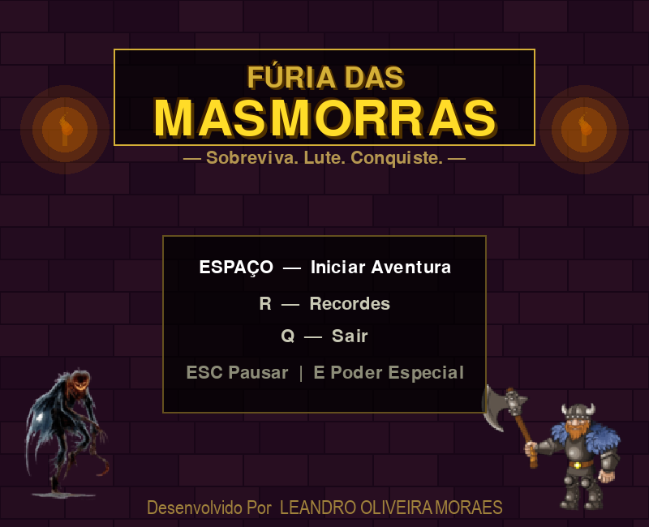

# Fúria das Masmorras



Beat 'em up 2D de ação e sobrevivência construído do zero com Python e pygame. Enfrente ondas crescentes de inimigos, derrote bosses épicos e chegue o mais longe possível — cada partida é um desafio novo.

---

## A História

Yusuki tem 11 anos e uma obsessão: videogames dos anos 80. Seu quarto é um museu vivo — cartuchos empilhados, controles enfileirados, cartazes nas paredes. Enquanto outras crianças dormem cedo, Yusuki passa horas decifrando cada pixel dos seus jogos favoritos, memorizando padrões, inventando histórias para os personagens que ninguém mais se importava.

Os adultos chamavam de vício. Yusuki chamava de paixão.

Numa sexta-feira à noite, depois de uma maratona que durou até as 3h da manhã, Yusuki adormeceu com o controle na mão — e entrou em um sonho diferente de todos os outros. Desta vez, o sonho não desfazia. Não virava outra coisa. Não tinha fim.

Ele se via no meio de uma **masmorra viva**, onde seus três heróis preferidos lutavam incansavelmente contra criaturas que ele reconhecia: monstros dos seus jogos favoritos, misturados com seres da sua própria imaginação, todos torcidos por algo obscuro.

Uma voz grave preencheu o silêncio entre os golpes:

> *"Bem-vindo à Masmorra dos Sonhos, Yusuki. Eu esperava por você há muito tempo."*

**O Inimigo Final** não é um monstro comum. É uma entidade que existe no espaço entre os sonhos — antiga, faminta, invisível para quem acorda. Ela se alimenta de imaginação: quanto mais vívida, mais nutritiva. E a imaginação de Yusuki, moldada por anos absorvendo histórias, mundos e personagens, é a mais rica que ela jamais encontrou.

Para mantê-lo preso, O Inimigo Final usa o próprio sonho de Yusuki como prisão — transforma seus mundos favoritos em labirintos, seus inimigos queridos em guardas, e coloca cinco de seus tenentes mais poderosos como guardiões de cada passagem.

**Se Yusuki não os derrotar, dorme para sempre.**

Os três heróis olham para ele. Ele os conhece melhor do que ninguém — cada golpe, cada fraqueza, cada estilo. A escolha é dele. O sonho espera.

---

## Rodando o jogo

**Dependências:**

```bash
pip install pygame Pillow
```

```bash
cd masmorra
python "import pygame.py"
```

---

## Controles

| Tecla | Ação |
|-------|------|
| `← →` | Mover |
| `↑` | Pular |
| `Espaço` | Atacar (combo encadeado) |
| `CTRL esq.` | Poder especial (custa 10 MP) |
| `ALT esq.` | Bloquear (reduz dano recebido) |
| `ESC` | Pausar |
| `R` | Ranking |
| `Q` | Sair |

---

## Personagens

Quatro estilos de jogo completamente distintos. A escolha muda a estratégia inteira:

| Personagem | Estilo | HP | Vel | Dano | Alcance |
|------------|--------|----|-----|------|---------|
| **Guerreiro** | Equilibrado — bom em tudo | 100 | 5 | 10 | 70 |
| **Mago** | Mata rápido, morre rápido | 70 | 4 | 20 | 130 |
| **Ladino** | Velocidade acima de tudo | 80 | 8 | 8 | 55 |
| **Velho Barbudo** | Ancião das runas — alto dano, baixa velocidade | 75 | 3 | 28 | 145 |

### Armas e poderes especiais

Cada personagem tem arma e poder especial únicos:

| Personagem | Ataque normal | Poder especial (`CTRL`) |
|------------|--------------|------------------------|
| **Guerreiro** | Machado giratório | 5 machados orbitando em volta do personagem |
| **Mago** | Cajado + orbe mágico pulsante | 6 chamas azuis orbitando em volta do personagem |
| **Ladino** | Espada em arco de slash | 5 espadas orbitando em volta do personagem |
| **Velho Barbudo** | Machadobarba giratório | 3 machadobarbas orbitando em volta do personagem |

### Animação de bloqueio (`ALT`)

Segurar `ALT` ativa a postura de defesa — cada personagem ergue sua arma na frente do corpo. Golpes bloqueados causam apenas **33% do dano normal** e produzem um impacto visual distinto (explosão dourada + faíscas).

| Personagem | Postura de defesa |
|------------|-------------------|
| **Guerreiro** | Machado horizontal — escudo de força bruta |
| **Mago** | Cajado ereto — barreira mágica |
| **Ladino** | Espada diagonal — parade rápida |
| **Velho Barbudo** | Machadobarba horizontal — bloqueio brutal |

---

## Sistema de MP

Cada personagem possui uma barra de **100 MP** exibida abaixo do HP. Usar o poder especial consome **10 MP**. Sem MP suficiente, o especial não dispara.

MP é recuperado coletando cristais de energia que aparecem no cenário:

| Item | Efeito | Frequência |
|------|--------|-----------|
| Cristal azul claro | +10 MP | Comum |
| Cristal azul | +20 MP | Comum |
| Cristal roxo | +50 MP | Raro |
| Cristal dourado | MP cheio | Muito raro |

---

## Como o jogo funciona

### Ondas e progressão
O jogo é infinito em teoria — as ondas não têm fim e a dificuldade escala continuamente. Cada onda eliminada recupera 20 HP e dá bônus de pontuação. Inimigos ficam mais rápidos, mais resistentes e mais numerosos conforme as ondas avançam.

### Sistema de combo
Três ataques em sequência ativam o **Golpe Devastador**: o terceiro hit causa o dobro do dano normal. O tempo entre golpes precisa ser curto — o encadeamento se quebra se você hesitar.

### Bosses
A cada cinco ondas, a música muda e um Boss entra em cena. Cada boss tem três fases — ao perder HP, fica mais agressivo e rápido. Derrotá-lo vale pontuação alta e garante um item no chão.

| Boss | HP | Elemento especial |
|------|----|-------------------|
| Dragão | 800 | Fogo — rajada de bolas de fogo |
| Cavaleiro Sombrio | 1000 | Raio — descargas elétricas em leque |
| Mago Maligno | 700 | Gelo — cristais de gelo em espiral |
| Lorde Demônio | 1200 | Pedra — rochas pesadas e lentas |
| Deus do Caos | 1600 | Ultimate — um projétil de cada elemento |

Cada boss dispara seu especial periodicamente — projéteis animados que saem do boss e viajam em direção ao jogador. Quanto mais baixo o HP, mais frequente e numeroso o disparo.

### Fase Final

A partir da onda 21 começa a **Fase Final** — o cenário muda para o Núcleo e cinco bosses supremos surgem em sequência, um por onda, cada um mais poderoso que o anterior:

| Boss final | HP | Elemento |
|------------|----|----------|
| Hydra das Trevas | 1.200 | Fogo |
| Senhor da Escuridão | 1.400 | Raio |
| Arauto do Caos | 1.600 | Água |
| Protetor Amaldiçoado | 1.800 | Pedra |
| **O Inimigo Final** | **4.800** | **Ultimate** |

### Além do Inimigo Final

Derrotar O Inimigo Final não encerra o jogo — revela a verdade: havia algo ainda mais antigo esperando nas sombras. Uma cadeia de **cinco entidades** surge em sequência, cada uma com o dobro de vida da anterior, e apenas derrotar a última liberta Yusuki de vez:

| Entidade | HP | Elemento |
|----------|----|----------|
| A Sombra Eterna | 9.600 | Fogo |
| O Devorador | 19.200 | Raio |
| Senhor do Abismo | 38.400 | Água |
| O Destruidor | 76.800 | Pedra |
| **A Entidade Final** | **153.600** | **Ultimate** |

Durante essas batalhas, itens de HP e MP aparecem com frequência aumentada automaticamente — a masmorra sabe que você vai precisar.

Derrotar **A Entidade Final** encerra o jogo com a tela de **Vitória** — Yusuki acorda livre.

### Vidas
Três vidas por partida. Ao zerar o HP, uma vida é consumida e o HP é completamente restaurado. Quando a última vida acaba, vai para o Game Over.

---

## Inimigos

**63 tipos** com sprites animados (GIF frame a frame), cada um com comportamento próprio. Não é só "vai na direção do jogador". Os inimigos são organizados em seis tiers de dificuldade crescente — quanto mais avançada a onda, mais tipos pesados entram em campo:

| Tier | Tipos | Característica |
|------|-------|---------------|
| 1 | 1 – 12 | Inimigos básicos, introdução aos comportamentos |
| 2 | 13 – 22 | Comportamentos especiais ativados |
| 3 | 23 – 32 | Stats reforçados, comportamentos reiniciados |
| 4 | 33 – 42 | Vida e dano significativamente maiores |
| 5 | 43 – 52 | Inimigos de elite |
| 6 | 53 – 63 | Inimigos finais — tanques e assassinos extremos |

Os **10 comportamentos** que se repetem e escalam ao longo dos tiers:

| Comportamento | O que faz |
|--------------|-----------|
| Atirador | Mantém distância e atira projéteis |
| Carregador | Faz cargas rápidas quando está perto |
| Fantasma | Fica imune periodicamente |
| Berserker | Acelera muito quando com pouco HP |
| Curandeiro | Regenera os aliados próximos |
| Gigante | Lento e tanque — pisada que chacoalha o chão e empurra o jogador |
| Assassino | Teletransporta atrás do jogador |
| Bloqueador | Reduz dano recebido de frente |
| Morto-Vivo | Ressuscita uma vez com metade do HP |
| Dividido | Ao morrer, vira dois inimigos menores |

---

## Itens

Inimigos têm chance de dropar algo ao morrer. Caminhe em cima para coletar automaticamente.

| Item | Efeito |
|------|--------|
| Poção | +25 HP |
| Poção Forte | +50 HP |
| Bomba | 40 de dano em todos os inimigos na tela |
| Cristal azul claro | +10 MP |
| Cristal azul | +20 MP |
| Cristal roxo | +50 MP |
| Cristal dourado | MP cheio |

---

## Cenários

O cenário troca sozinho conforme a onda progride, com música própria para cada ambiente:

| Ondas | Cenário | Elemento do sonho |
|-------|---------|-------------------|
| 1 – 4 | Masmorra | As dungeons dos seus RPGs favoritos |
| 5 – 9 | Floresta | As florestas dos seus jogos de aventura |
| 10 – 14 | Castelo | Os castelos que ele desenhava no caderno |
| 15 – 19 | Vulcão | Os vulcões dos seus jogos de plataforma |
| 20 | Céu | A fronteira do sonho |
| 21+ | Fase Final | O Núcleo — o coração escuro do sonho |

Durante os bosses a música muda para a trilha de batalha. Se um arquivo de música não for encontrado, o jogo cai automaticamente para `musica_fundo.mp3` — sem crash, sem interrupção.

---

## Ranking

As cinco melhores pontuações ficam salvas em `ranking.json`. Acessível pelo menu principal, pela tela de pausa ou pelo Game Over.

---

## Arquivos do projeto

```
masmorra/
├── import pygame.py           # Código principal
├── ranking.json               # Recordes (gerado automaticamente)
│
├── personagem.png             # Guerreiro
├── mago.png                   # Mago
├── ladino.png                 # Ladino
├── velhobarbudo.png           # Velho Barbudo
├── inimigo.gif – inimigo63.gif  # 63 inimigos animados
├── inimigofinal.gif           # O Inimigo Final (animado)
├── bossfinal1.png … bossfinal5.png  # Cadeia de entidades finais
├── item.png                   # Sprite dos itens
├── machado.png                # Arma do guerreiro
├── cajado.png                 # Arma do mago
├── espada.png                 # Arma do ladino
├── machadobarba.png           # Arma do velho barbudo
├── fundo.jpg                  # Cenário da masmorra
├── fundofloresta.png          # Cenário floresta
├── fundocastelo.png           # Cenário castelo
├── fundovulcão.png            # Cenário vulcão
├── fundocéu.png               # Cenário céu
├── fundofinal.png             # Cenário da fase final
│
├── ataque.wav                 # Som de ataque
├── colisao.wav                # Som de dano
├── coleta.wav                 # Som de coleta de item
├── pulo.wav                   # Som de pulo
└── musica_fundo.mp3           # Música padrão / fallback
```

**Arquivos opcionais** — o jogo gera tudo proceduralmente se não encontrar:

```
boss1.png … boss5.png
item_bota.png / item_bomba.png / bomba.wav
musica_dungeon.mp3 / musica_floresta.mp3 / musica_castelo.mp3
musica_vulcao.mp3 / musica_ceu.mp3 / musica_boss.mp3
```

---

## Stack

- **Python 3.10+**
- **pygame 2.x**
- Persistência local via **JSON**
- Áudio: **WAV** (efeitos) + **MP3** (trilha)

---

**Desenvolvido por Leandro Oliveira Moraes**
